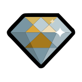

# Fluorite



Fluorite - Simplest and fully-customizable RPC standalone infrastructure on .NET

[](https://www.repostatus.org/#wip)

## NuGet

|Package|main|devel|Description|
|:--|:--|:--|
|Fluorite|[](https://www.nuget.org/packages/Fluorite)|[](https://www.myget.org/feed/fluorite/package/nuget/Fluorite)|Meta-package (Provides automated generating static proxy)|
|Fluorite.Dynamic|[](https://www.nuget.org/packages/Fluorite.Dynamic)|[](https://www.myget.org/feed/fluorite/package/nuget/Fluorite.Dynamic)|Meta-package (Provides automated generating dynamic proxy)|

### Sub packages

|Package|main|devel|Description|
|:--|:--|:--|
|Fluorite.Core|[](https://www.nuget.org/packages/Fluorite.Core)|[](https://www.myget.org/feed/fluorite/package/nuget/Fluorite.Core)|Independed core engine|
|Fluorite.Serializer|[](https://www.nuget.org/packages/Fluorite.Serializer)|[](https://www.myget.org/feed/fluorite/package/nuget/Fluorite.Serializer)|Default serializer implementation (Newtonsoft.Json)|
|Fluorite.Transport|[](https://www.nuget.org/packages/Fluorite.Transport)|[](https://www.myget.org/feed/fluorite/package/nuget/Fluorite.Transport)|Default transport implementation (System.Net.WebSockets)|
|Fluorite.Build|[](https://www.nuget.org/packages/Fluorite.Build)|[](https://www.myget.org/feed/fluorite/package/nuget/Fluorite.Build)|Automated static proxy generator at building time|

## CI

|main|devel|
|:--|:--|
|[](https://github.com/kekyo/Fluorite/actions?query=branch%3Amain)|[](https://github.com/kekyo/Fluorite/actions?query=branch%3Adevel)|

-----

## What is this ?

An implementation of asynchronous RPC (remote procedure call) controller.

Fluorite doesn't have depending other large libraries (For example: ASP.NET).
You can easy integrate flexible bi-directional messaging system on your own application.

### Features

* Can do truly bi-directional operation between server and client.
  * Complementary interface.
  * With overlapping calls and will do non-blocking (if transport has capability).
* Fully asynchronous sending/receiving operation with `ValueTask<T>` type.
* RPC form on custom interface definition.
  * You can choose static proxy (at building time) or dynamic proxy (at runtime).
  * Or you can attach your own custom proxy generator.
* Can attach your own custom serializer likes Json or another form by simple interface.
  * Json, Bson, XML, Message Pack, Protocol Buffer and etc...
  * Will make simpler logical message format.
* Can attach your own custom transport likes WebSocket or another protocol by simple interface.
  * WebSocket, TCP/UDP direct, Pipe, IPC, MQ, Persistence data and etc...

-----

## Getting started

Default configuration (meta-package) is applied with:

* Will use serializer `Newtonsoft.Json`.
* Will use transport `System.Net.WebSockets`.
  * Client side: `ClientWebSocket`.
  * Server side: `WebSocket` on `HttpListener`.

NOTE: When running on Windows platform, you have to configure `HttpListener`/`HTTP.SYS` related setup protocol on server side. For example:

1. `netsh http add urlacl url=http://+:4649/ user=everyone`
2. `netsh advfirewall firewall add rule name="Fluorite HTTP" dir=in action=allow`
3. `netsh advfirewall firewall set rule name="Fluorite HTTP" new program=system profile=private protocol=tcp localport=4649`

### Custom RPC interface definition

We can use independent platform such as `netstandard2.0` or likes.

```csharp
using Fluorite;  // nuget install Fluorite.Core

// You can use custom types each arguments/return value, constraint depending used serializer.
// (Default serializer is Newtonsoft.Json)
public sealed class Item
{
    public int Id;
    public string Label;
    public int Price;
}

// Require inherits `IHost` and method returns ValueTask<T>.
public interface IShop : IHost
{
    ValueTask<Item[]> GetItemsAsync(string category, int max);
    ValueTask<int> PurchaseAsync(params int[] itemIds);
}
```

### Client side

```csharp
using Fluorite;  // nuget install Fluorite.Dynamic

// Connect to server with default websocket/json transport.
// (Optional: You can register client side expose object at last arguments same as server side)
var nest = await Nest.Factory.ConnectAsync("server.example.com", 4649, false);
try
{
    var shop = nest.GetPeer<IShop>();
    var items = await shop.GetItemsAsync("Fruit", 100);

    var total = await shop.PurchaseAsync(items[3].Id);
    Console.WriteLine(total);
}
finally
{
    await nest.ShutdownAsync();
}
```

### Server side

```csharp
using Fluorite;  // nuget install Fluorite.Dynamic

// The exposed interface implementer.
public sealed class Shop : IShop
{
    public async ValueTask<Item[]> GetItemsAsync(string category, int max)
    {
        // ...
    }

    public async ValueTask<int> PurchaseAsync(params int[] itemIds)
    {
        // ...
    }
}

// Start default websocket/json server with expose objects at last arguments.
var nest = await Nest.Factory.StartServer(4649, false, new Shop());
try
{
    // ...
}
finally
{
    await nest.ShutdownAsync();
}
```

-----

## Static proxy generator

TODO:

-----

## Advanced topic

### Customize with your own serializer

TODO:

### Customize with your own transport

TODO:

### Customize with your own proxy factory

TODO:

-----

## License

Apache-v2
